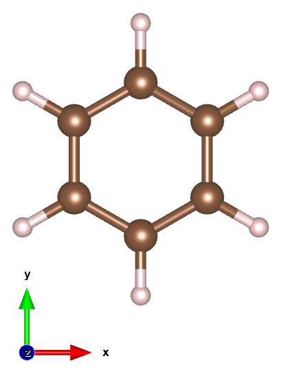
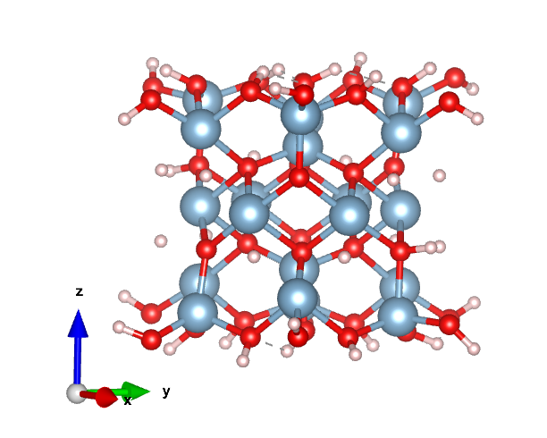
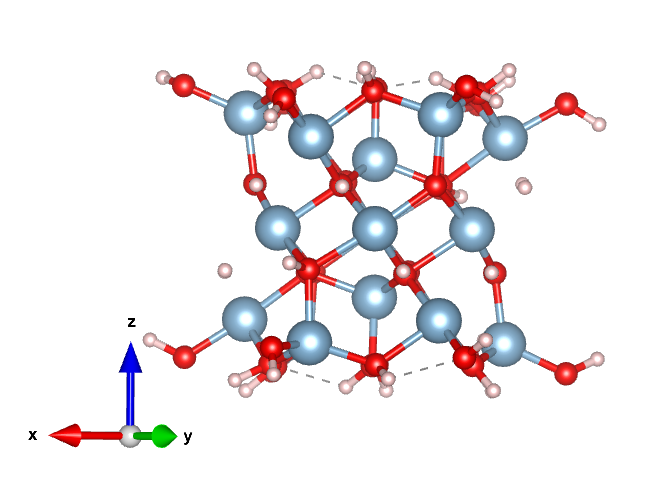
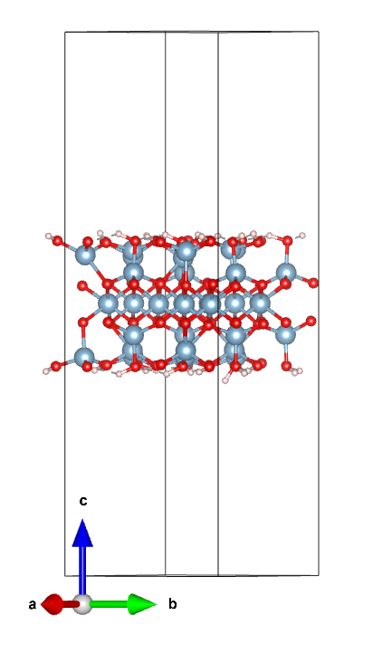
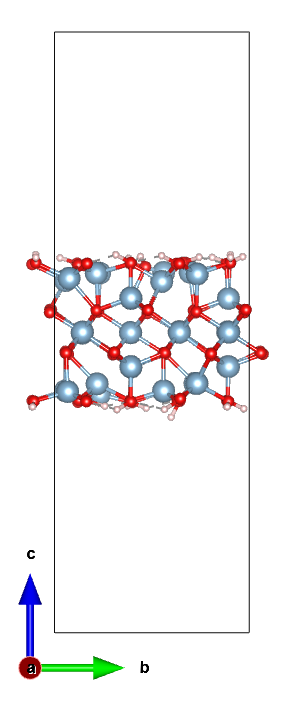
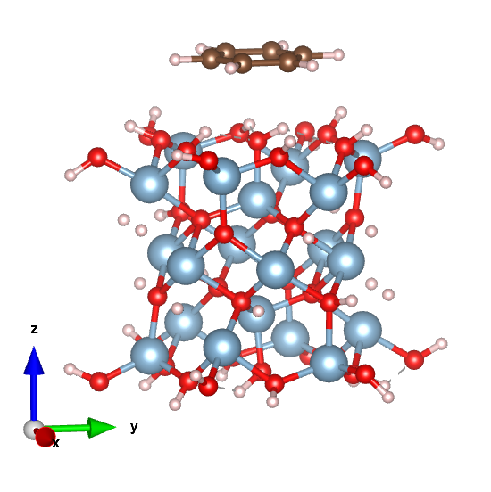
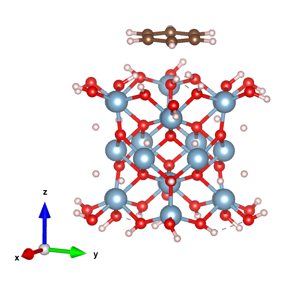
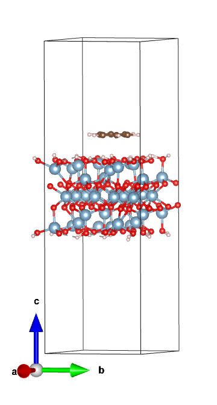
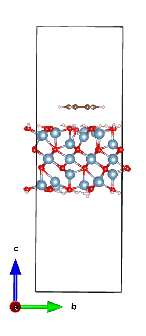

[:fontawesome-solid-house:](../index.md) :fontawesome-solid-angle-right: [User Guides](index.md) :fontawesome-solid-angle-right: **Complexes**
# How to make a Complex using molecule_lib

This user guide will show you how to create a complex using molecule_lib. Complexes are used for modeling minearal surface reactions. You can also create a stack using the ABC/XYZMolecule.add_coords() method. This code works for electronic structure and periodic boundary molecular structures.

## Step 0: Import molecule_lib

``` python
from molecule_lib import *

```

## Step 1: Create Molecule Objects

``` python
absorbent = read_xyz("absorbent.xyz")
slab = read_xyz("slab.xyz")

```

You can create a complex in an ABCMolecule or XYZMolecule object. The example shown here is for an XYZMolecule object but the code and process is the same for creating a complex using ABCMolecule objects.

## Step 2 Combine two files and make a complex

``` python
mol_complex = slab.add_coords(molecule=absorbent,
                              axis="z", 
                              absorbent_reference="Bottom",
                              surface_reference="Top",
                              dist=2.0)

```

Click the link here to learn more about the arguments for the ABC/XYZMolecule.add_coords() method that is used to create the complex. [Link](https://jerschro.github.io/molecule_lib_documentation/reference/XYZMolecule/add_coords/). You can combine ABCMolecule and XYZMolecule objects together, the details of how molecule_lib does this is explained in the API Reference. It is advised to only add XYZMolecule objects to an ABCMolecule object because to combine two ABCMolecule objects you need to have the exact same LatticeMatrix.

## Step 3: Save the new Complex

``` python 
mol_complex.to_xyz("complex.xyz")

```

## Pictures of Example Files Used to Create Complexes

=== ":fontawesome-solid-house:"
    Click through the tabs to see the files used and created by molecule_lib to create a complex.

    Pictures are from the program VESTA.


=== "absorbent.xyz"
    

=== "slab.xyz"
    <div class="grid">
    
    
    </div>

=== "slab.vasp"
    <div class="grid">
    
    
    </div>

=== "complex.xyz"
    <div class="grid">
    
    
    </div>

=== "complex.vasp"
    <div class="grid">
    
    
    </div>